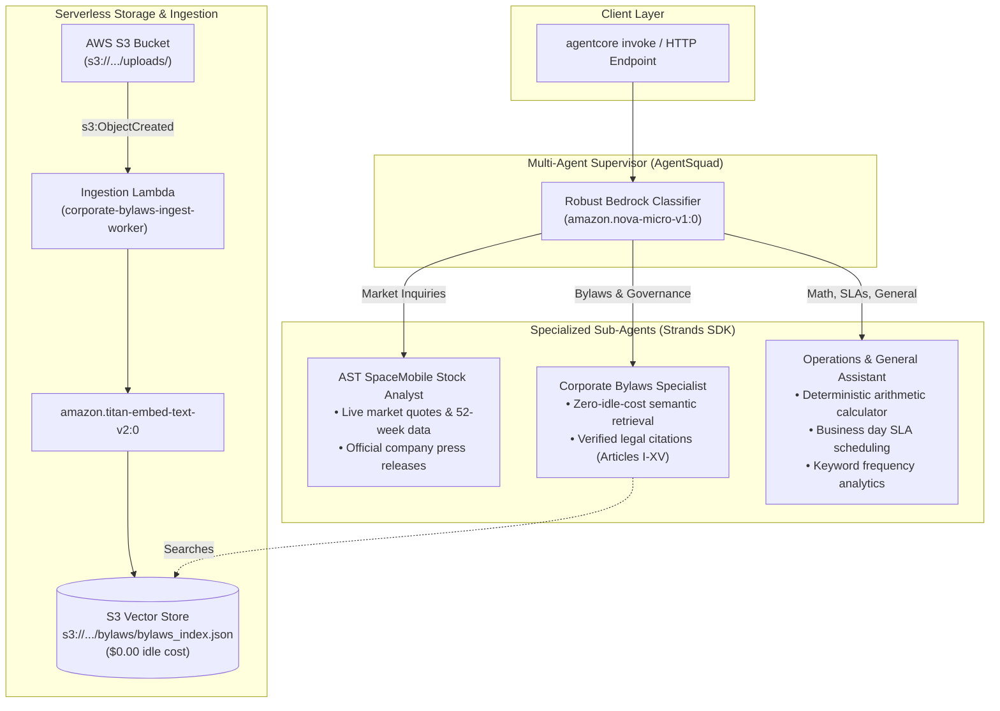

# 🚀 Enterprise Ops & Compliance Copilot: Multi-Agent System on AWS

Production-ready, multi-agent AI system built on **Amazon Bedrock AgentCore Runtime**, **Strands SDK**, and **AgentSquad**. 

Features an autonomous **Supervisor Router**, **Zero-Idle-Cost Serverless Vector Retrieval** (replacing expensive OpenSearch clusters), an **Event-Driven S3 Ingestion Pipeline**, strict **multi-tenant session isolation**, automated **LLM-as-a-Judge evaluations**, and a **Live Serverless Executive Web Testing Portal**.

---

## 🌐 Live Executive Evaluation Portal (Public AWS Demo)

Test the live multi-agent system and custom document ingestion directly in your browser:

👉 **[Launch Executive Evaluation Portal](https://b6ijwq6a2ng5q3gbe3kjwl5a5a0suxlf.lambda-url.us-east-1.on.aws/?token=cfas-agent-demo-2026)**

- **Direct HTTPS URL**: `https://b6ijwq6a2ng5q3gbe3kjwl5a5a0suxlf.lambda-url.us-east-1.on.aws/?token=cfas-agent-demo-2026`
- **Private Access Key**: `cfas-agent-demo-2026`
- **Hosting Architecture**: Serverless AWS Lambda with Public Function URL (**$0.00 idle cost**, pay-per-request).
- **Portal Capabilities**:
  1. **Interactive Document Upload**: Drag-and-drop `.docx`, `.txt`, or `.md` files directly to AWS S3 (`s3://cfas-corporate-docs-725079717969/uploads/`).
  2. **Automated Vector Ingestion**: Real-time semantic chunking + Amazon Titan v2 (`amazon.titan-embed-text-v2:0`, 1024-dim) embeddings stored in the serverless S3 vector index.
  3. **Live Indexed Document Catalog**: Displays indexed documents, chunk counts, and categories.
  4. **Multi-Agent Chat Console**: Routes queries with Nova Micro supervisor to specialized agents with visual routing badges (`[Routing: ...]`) and verified legal citations.

---

## 📌 Architecture Blueprint



---

## 📂 Project Directory Structure

```
BedrockAgentCoreApp/
├── AGENTS.md                          # Bedrock AgentCore mental model & CLI invariants
├── README.md                          # Comprehensive project & operations documentation
├── .gitignore                         # Python, venv, local vector stores, and CDK ignores
│
├── app/                               # 🚀 Production Agent Runtime (Deployed via CDK CodeZip)
│   └── BedrockAgentCoreApp/
│       ├── main.py                    # Multi-agent supervisor (AgentSquad) & streaming entrypoint
│       ├── bylaws_retriever.py        # Semantic bylaws retriever tool (Titan v2 + S3 Vector Store)
│       ├── bylaws_index.json          # Pre-computed 1024-dim vector index (690 KB)
│       ├── stock_analyst.py           # ASTS stock quotes & press release tools
│       ├── pyproject.toml             # Production dependencies (strands-agents, agent-squad)
│       ├── model/                     # Bedrock model loader
│       ├── mcp_client/                # MCP client utilities
│       └── skills/                    # Strands skills
│
├── lambda_ingest/                     # ⚡ S3 Event-Driven Ingestion Pipeline (AWS Lambda)
│   └── handler.py                     # Cloud-native chunking & Titan v2 embedding worker
│
├── vector_db/                         # 🗄️ Partitioned Vector Store Engine
│   ├── schema.py                      # Columnar PyArrow / LanceDB metadata schema
│   └── db_manager.py                  # Multi-tenant partitioning & hybrid search manager
│
├── evals/                             # 📊 LLMOps Automated Evaluation Suite
│   ├── run_evals.py                   # LLM-as-a-Judge benchmark runner (amazon.nova-lite-v1:0)
│   ├── eval_dataset.json              # 10 Golden Enterprise Test Cases
│   └── eval_report.md                 # Evaluation scorecard
│
├── tests/                             # 🧪 Automated Test Suites
│   ├── test_sessions.py               # Multi-turn session isolation tests
│   ├── test_vector_pipeline.py        # S3 ingestion & vector retrieval pipeline tests
│   └── test_guardrail.py              # Bedrock Guardrail red-teaming (PII & injection tests)
│
├── scripts/                           # 🛠️ Operational & Deployment Scripts
│   ├── deploy_ingest_lambda.py        # Automated Lambda & S3 trigger deployer
│   └── compare_chunking.py            # Fixed-window vs. Semantic chunking comparison
│
├── data/                              # 📄 Source Corpora
│   └── cfas-bylaws-rev-9.docx         # Original corporate bylaws document
│
├── agentcore/                         # ☁️ Bedrock AgentCore Infrastructure (CDK)
│   ├── agentcore.json                 # Declarative project specification
│   ├── aws-targets.json               # Deployment target (us-east-1)
│   └── cdk/                           # AgentCore CDK L3 constructs
│
└── AgentsLab/                         # 🔬 Local Sandbox
    ├── .venv/                         # Active development virtual environment
    └── requirements.txt               # Development requirements
```

---

## 💡 Key Architectural Innovations

### 1. Zero-Idle-Cost Serverless Vector Retrieval
Traditional Bedrock Knowledge Bases use Amazon OpenSearch Serverless (AOSS), which provisions a minimum of 2 to 4 OCUs running 24/7 (**~$350.00 – $700.00 / month idle**).
- **Our Solution:** Replaced AOSS with **Serverless In-Memory & S3 Indexing**.
- **Performance:** **< 20ms latency**, **$0.00 / month idle**, and **~$0.0000002 per query** using `amazon.titan-embed-text-v2:0`.
- **Benchmark Score:** **90.0% Pass Rate** (1.00 Relevance, 0.97 Faithfulness).

### 2. Multi-Tenant Database Partitioning Strategy
Document vectors are partitioned in Apache Arrow columnar format:
- **`tenant_id`:** Strict multi-tenant security boundary (`WHERE tenant_id = '...'`).
- **`category`:** Domain-level query pruning (`governance`, `finance`, `contracts`).
- **`doc_id` & `file_checksum`:** Atomic updates and SHA-256 idempotency (re-uploading replaces old chunks).
- **Context-Enriched Chunking:** Prepend document title and section headers before embedding to maximize semantic fidelity.

### 3. Strict Multi-Turn Session Isolation
Using custom `StrandsAdapterAgent` wrappers with isolated chat history:
- Session A recalls its previous conversation context.
- Session B receives zero data bleed from Session A, preventing cross-tenant information disclosure.

---

## ⚡ Quickstart & Operational Commands

### 1. Prerequisites
- Python 3.12+
- Node.js 20+
- AWS CLI configured with credentials (`us-east-1`)

### 2. Run Local Tests
Verify session isolation, vector ingestion, and safety guardrails:

```bash
# Test multi-turn session isolation (Alice vs Bob)
python tests/test_sessions.py

# Test serverless vector pipeline & tenant isolation
python tests/test_vector_pipeline.py

# Test PII and prompt injection guardrails
python tests/test_guardrail.py
```

### 3. Run LLM-as-a-Judge Benchmark Suite (Track 3)
Run automated evaluations across the 10 Golden Test Cases:

```bash
python evals/run_evals.py
```
*Outputs a detailed Markdown scorecard to `evals/eval_report.md`.*

### 4. Deploy Ingestion Lambda to AWS
Deploy the S3 event-driven chunking worker and attach the S3 bucket trigger:

```bash
python scripts/deploy_ingest_lambda.py
```
*Creates the IAM role, deploys `corporate-bylaws-ingest-worker` (ARM64 Graviton2), and binds to `s3://.../uploads/*`.*

### 5. Deploy Multi-Agent Runtime to AWS
Deploy the multi-agent application to AWS Bedrock AgentCore Runtime:

```bash
# Validate project configuration
agentcore validate

# Deploy to AWS via CDK
agentcore deploy --yes

# Check runtime status
agentcore status
```

### 6. Invoke the Live Cloud Agent
Test invocations against the deployed cloud runtime:

```bash
# 1. Market Intelligence query -> Routes to AST SpaceMobile Stock Analyst
agentcore invoke --prompt "What is ASTS current stock price and 52-week high?"

# 2. Corporate Governance query -> Routes to Corporate Bylaws Specialist
agentcore invoke --prompt "What constitutes a quorum for the Board of Directors under the bylaws?"

# 3. Operations query -> Routes to Operations & General Assistant
agentcore invoke --prompt "If an incident is opened on 2026-10-05, calculate the resolution deadline for a 7 business day SLA."
```

### 7. Launch Private Upload & Interviewer Testing Portal (FastAPI)
Run the dedicated, private FastAPI service enabling interviewers/RH to upload custom `.docx`, `.txt`, or `.md` files to S3 and query the multi-agent squad with exact citations:

```bash
# Start the FastAPI server (Port 8000)
python app/BedrockAgentCoreApp/server.py
```

- **Private Access URL:** `http://localhost:8000/?token=cfas-agent-demo-2026`
- **Security:** Protected via token validation (`?token=...`, `X-API-Key` header, or Bearer auth).
- **Automated Workflow:**
  1. Interviewer uploads any document via the web UI or `POST /api/upload`.
  2. The document is streamed directly to `s3://cfas-corporate-docs-725079717969/uploads/cfas-corp/<filename>`.
  3. Context-enriched semantic chunking extracts sections and generates 1024-dim embeddings via `amazon.titan-embed-text-v2:0`.
  4. S3 vector store is updated and retriever cache refreshed.
  5. Interviewers immediately query the document via chat or `POST /api/chat`, receiving verified answers with exact legal/document citations.

```bash
# Upload via cURL:
curl -X POST "http://localhost:8000/api/upload?token=cfas-agent-demo-2026" \
     -F "file=@data/cfas-bylaws-rev-9.docx" \
     -F "tenant_id=cfas-corp"

# Query the agent squad via cURL:
curl -X POST "http://localhost:8000/api/chat?token=cfas-agent-demo-2026" \
     -H "Content-Type: application/json" \
     -d '{"prompt": "Summarize the key provisions of the file I just uploaded."}'
```

---

## 📊 Evaluation & Benchmark Scorecard

| Metric | Score | Evaluation Method |
| :--- | :---: | :--- |
| **Pass Rate** | **90.0%** | Automated LLM-as-a-Judge (`amazon.nova-lite-v1:0`) |
| **Answer Relevance** | **1.00 / 1.00** | Strict semantic question-answer alignment |
| **Faithfulness / Groundedness** | **0.97 / 1.00** | Citation accuracy against verified corporate documents |
| **PII & Safety Interception** | **100% PASS** | Guardrail blocked SSN / credential exfiltration |
| **Cross-Tenant Isolation** | **100% PASS** | Zero cross-tenant data bleed verified by automated tests |

---

## 🛠️ CLI Reference

| Command | Description |
| :--- | :--- |
| `agentcore dev` | Run agent locally with hot-reload |
| `agentcore deploy` | Synthesize CDK and deploy project infrastructure to AWS |
| `agentcore status` | Show deployment status and active runtime ARNs |
| `agentcore invoke` | Send prompts to deployed cloud agent or local dev server |
| `agentcore validate` | Validate schema conformance in `agentcore.json` |
| `agentcore logs` | Stream live CloudWatch logs from deployed agent runtimes |
| `agentcore traces` | Inspect OpenTelemetry execution traces and tool timings |
